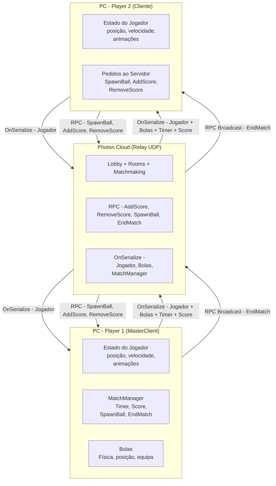

# Projeto Final - Sistemas de Redes para Jogos

## Autoria:

- Dinis Barroso - a22405350

## Introdução:

Neste projeto tentei recriar o minijogo de Kingdom Hearts 2, **Struggle Battles**, em formato 2D e Multiplayer de **ação**.


A ideia do jogo é haverem dois jogadores, presos numa arena fechada, a tentaram roubar as bolas um do outro, atacando-se. 

Quando um jogador é atacado, fica num estado temporário de "stun" e larga uma bola que saltita pelo mapa, até ficar sem fricção.

Ao fim de 2 minutos, o jogador com o maior número de bolas vence.


Ao contrário do jogo original, nesta versão cada jogador tem 40 bolas e as partidas têm maior tempo de duração.

## Instruções

#### -- Controlos --
- Z - Saltar
- X + Direção (ou sem direção)- Atacar
- C - Defender
- Baixo + Z - Saltar de uma plataforma
- Direção + C - Dash/Quick Roll

#### Como iniciar servidor:
Para partidas privadas, selecionar "Host".

Para partidas aleatórias, seleciona "Fight Random", é capaz de selecionar uma sala em vez de a criar.


## Descrição técnica

Para desenvolvimento, decidi utilizar a biblioteca **Photon PUN 2**, e criar o projeto com tecnologia **Peer-to-Peer** com **Netcode baseado em delay**, [que é o tipo de redes que este tipo de jogos utilizam, sem contar o Rollback.](https://glossary.infil.net/?t=Delay-Based%20Netcode)

Inicialmente pensei em utilizar FishNetworking com servidores Epic, pelo que se vê nos ficheiros, mas acabei por mudar.

No menu, existem duas opções para partidas, um modo que permite jogar com um amigo via código, e um modo de Matchmaking que obtém a lista de partidas e tenta entrar numa, ou criar se não existirem partidas abertas.

Ao clicar nos botões, o cliente pede aos servidores **Photon Cloud** para criar uma sala e tornar-se no **Servidor** (ou Master Client), ou juntar-se como **Cliente** à sala.

O botão de Matchmaking não funciona com partidas feitas no botão "Host" por design.


Ao começar ou entrar numa partida, o jogador é levado para a sala, onde começa o temporizador global caso haja outro jogador.

[Usei este vídeo no começo para o menu de matchmaking](https://www.youtube.com/watch?v=C6dXcMo2x40) + [a documentação sobre Matchmaking do Photon.](https://doc.photonengine.com/realtime/current/lobby-and-matchmaking/matchmaking-and-lobby)

Também defino o "Rate" de envio e de serialização para 60, que é o normal em jogos de luta, pois antes dessa mudança, o jogo tinha pior preformance.


Durante a partida, o primeiro jogador age como **servidor**, sendo o mesmo que gere o temporizador ```(if (PhotonNetwork.IsMasterClient) matchTime -= 1f)```, as pontuações e GameObjects ```(PhotonNetwork.Instantiate)```.

O segundo jogador apenas pede ao servidor para incrementar a sua pontuação, instanciar e remover objetos, via **Mensagens RPC**, enviando informações sobre o seu estado, o seu **Rigidbody2D**, e da sua equipa, via ```(OnPhotonSerializeView)```, recebendo o resto das informações.

Quando ataca sucessivamente o jogador, envia a equipa e o lado de onde atacou via ```(initData)```.

Utilizei esta parte da [documentação Photon para como fazer pedidos de métodos para o servidor.](https://doc.photonengine.com/pun/current/gameplay/rpcsandraiseevent)

Cada jogador gere as suas próprias físicas, colisões e variáveis das animações, enviando-as um ao outro, com o servidor a gerir as físicas das bolas.

Quando um jogador recebe posições do outro ou das bolas, tenta calcular o tempo da mensagem com o do servidor, e assim adivinha a posição atual, sendo esta técnica chamada de [**Lag Compensation**](https://doc.photonengine.com/pun/current/gameplay/lagcompensation).

De seguida, em vez de teletransportar o **Rigidbody2D**, tenta movê-lo para a posição, com uma velocidade própria, reduzindo problemas de *Jittering*.

Como referido anteriormente, cada jogador verifica as suas colisões, e verifica se está a defender localmente, para não causar *Input Delay*, e se sofrer dano, pede ao servidor para remover a sua bola.


Quando o temporizador do servidor acaba, o mesmo envia aos jogadores (A ele próprio e ao outro cliente) uma mensagem RPC a sinalizar o fim de jogo e a indicar que equipa venceu.

Se um jogador se desconectar da partida, a partida acaba prematuramente e exibe o ecrã de voltar.

#### Limitações

Neste momento, não é possível reentrar numa partida aleatória, em caso de desconexão, a partida simplesmente acaba.

Devido ao uso de **Netcode por delay**, a partida pode ficar instável caso um dos jogadores tenha uma rede insuficiente.

Não é possível inicial partidas por **Lan** pois o jogo necessita dos servidores Photon para ser jogado.

## Análise de banda larga


Durante uma partida, onde ambos os jogadores batalham por todas as bolas e só as tentam apanhar no final, o jogo consome tráfego de **Upload** de 569426 bytes (556 KB), e **Download** de 1075632 bytes (1.03 MB).

## Diagrama de arquitetura de redes



## Bibliografia

- Vídeo sobre salas Photon - https://www.youtube.com/watch?v=C6dXcMo2x40
- Documentação do Photon - https://doc.photonengine.com/pun/current/
- Fighting game glossary - https://glossary.infil.net/index.html